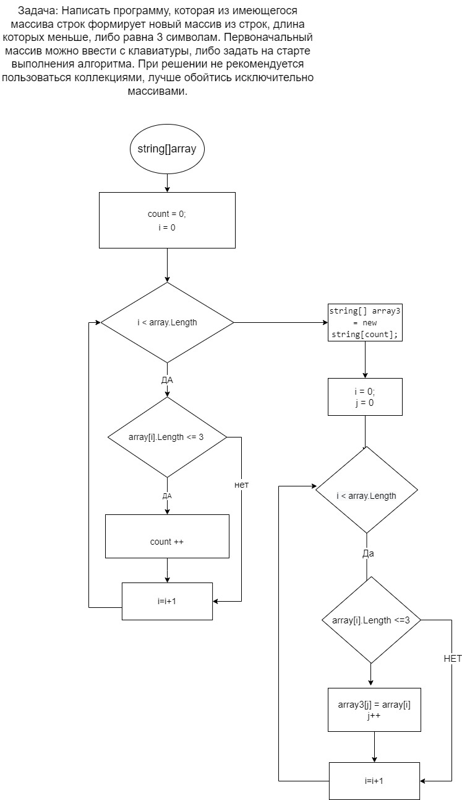

# Final Task
## Итоговая работа для  проверки наших знаний и навыков по итогу прохождения первого блока обучения на программе Разработчик.
# Задача : 
### Написать программу, которая из имеющегося массива строк формирует новый массив из строк, длина которых меньше, либо равна 3 символам. Первоначальный массив можно ввести с клавиатуры, либо задать на старте выполнения алгоритма. При решении не рекомендуется пользоваться коллекциями, лучше обойтись исключительно массивами.
# Описание решения  :
1. Запрашиваем у пользователя длинну массива
2. С помощью метода заполняем массив 
3. Создаем метод, в котором создаем новый массив из строк длина которого меньше либо равно трем. 
4. С помощью цикла заполняем новый массив сравненивая его с задаными параметрами. 
5. С помощью метода выводим новый массив.

### Блок схема:
